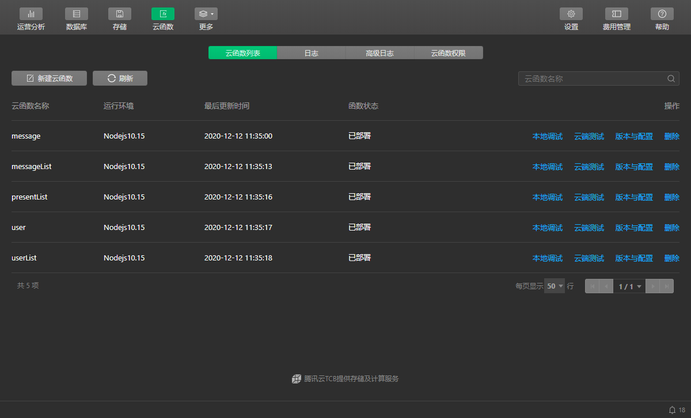
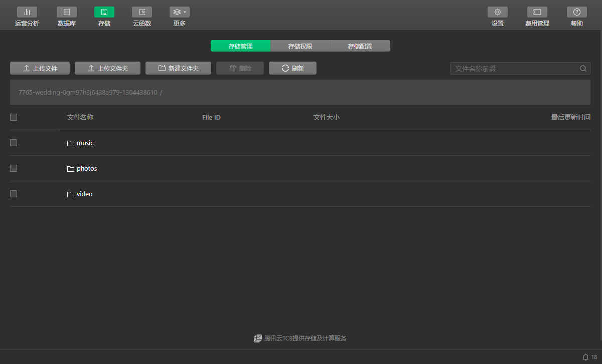
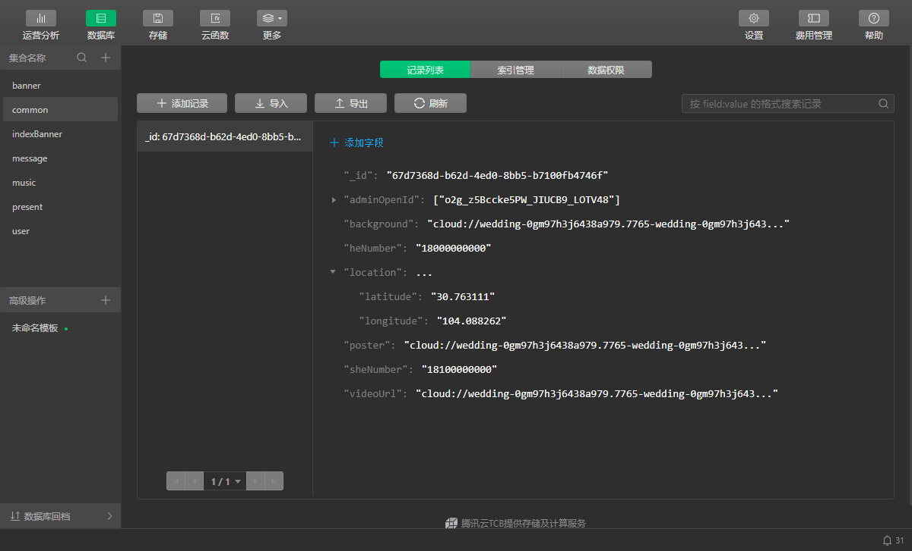
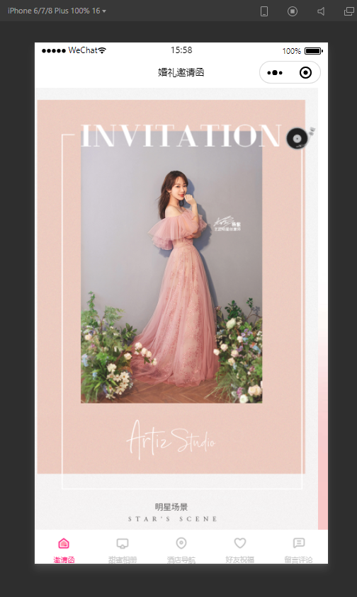

# wedding-invitation

> Mpvue+微信小程序开发的电子请帖。从码云[wedding](https://gitee.com/roberthuang123/wedding)项目 Fork 而来，感谢原作者[roberthuang123](https://gitee.com/roberthuang123)贡献分享。我在此基础上修改了一些细节，具体如下：

* 增加留言板删除功能，指定某个 openid 可以删除。
* 修改 audio 标签为 innerAudioContext。
* 电话号码和视频都存云数据库请求而来。
* 留言板出席电话简单隐藏。
* 修改我要出席逻辑，已经填过出席的再次填是修改之前填的。
* 增加 CSS 动画效果。

以上贡献出来，希望帮助有缘人^\_^

## 体验


## 说明

大家不要直接跑本项目，需要开通云开发，现做简要说明，不懂可以发邮件问我。

1. 修改 `project.config` 中 `appid` 为你的小程序 id。
2. 微信开发者工具导入项目。
3. 开通云开发，设置环境名称，选 支持按量付费中 `基础版 1`，免费的，基本够用了。
4. `main.js` 中配置云开发环境ID。
  ```js
  wx.cloud.init({
    env: '你的云开发环境ID'
  })
  ```
5. 云开发控制台云函数中上传并部署云函数。

 - 微信开发者工具中找到static/functions目录。
 - functions 上右键指定当前环境，然后同步云函数列表。
 - functions 中每个文件夹上右键选择 `上传并部署`

  

6. 把你要用到的音乐、图片、视频资源放到 `/data/存储/`下面的文件夹中。

7. 云开发控制台存储中上传这些文件夹。

  

8. 云开发控制台数据库中新建集合 `banner`, `common`, `indexBanner`, `message`, `music`,`present`,`user`。**注意**集合的数据权限要设置为`所有用户可读，仅创建者可读写`。

9. 编辑 `/data/数据库/` 中 `banner`(首页轮播图), `common`(位置、电话等配置), `indexBanner`(第二页轮播图), `music`(背景音乐路径) 指示的路径，url 改成你想要展示的，具体从存储里面读取。

10. 将`/data/数据库/`中的json文件对应导入到步骤 8 建的集合中。

  


最后预览

 

上手前可以先熟悉云开发文档结合原作者的掘金文章[项目讲解](https://juejin.im/post/5c341e1d6fb9a049f66c4876)一起使用。


## Build Setup

```bash
# 安装依赖
yarn

# 开发时构建
npm dev

# 打包构建
npm build

# 指定平台的开发时构建(微信、百度、头条、支付宝)
npm dev:wx
npm dev:swan
npm dev:tt
npm dev:my

# 指定平台的打包构建
npm build:wx
npm build:swan
npm build:tt
npm build:my

# 生成 bundle 分析报告
npm run build --report
```

For detailed explanation on how things work, checkout the [guide](http://vuejs-templates.github.io/webpack/) and [docs for vue-loader](http://vuejs.github.io/vue-loader).
